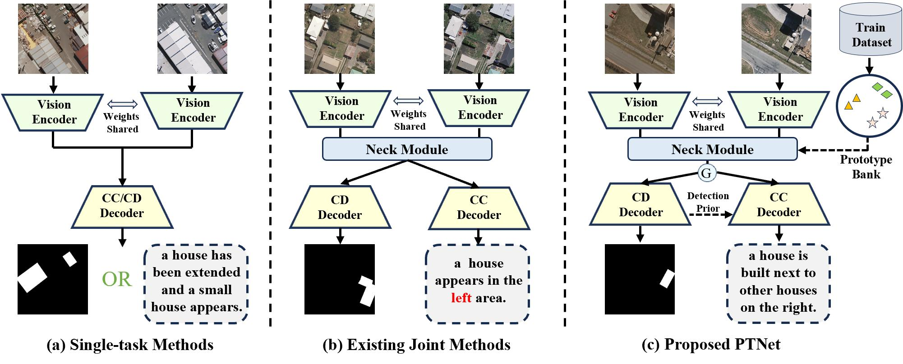
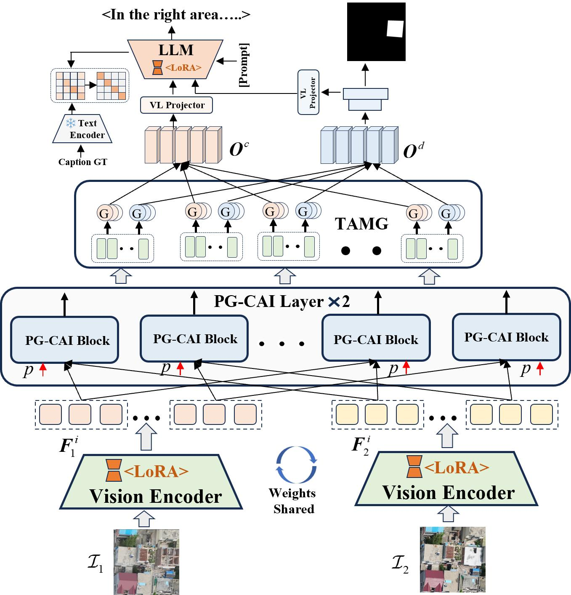
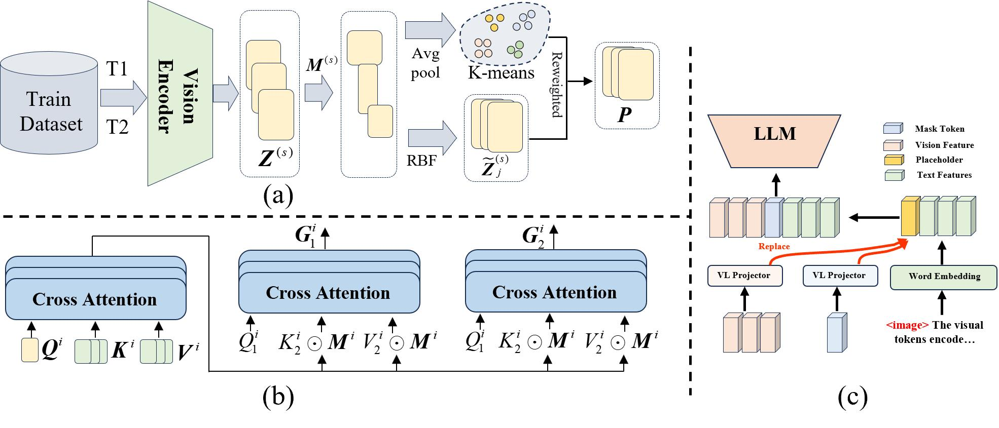
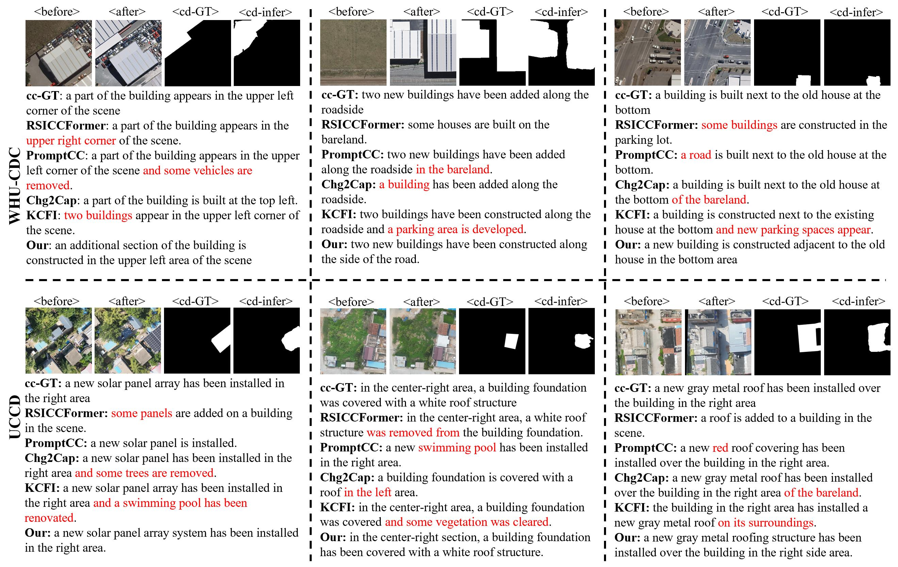

<div align="center">

<h1>UAV as Urban Construction Change Monitor</h1>
<h3>A New Benchmark and Change Captioning Model</h3>

<a href="https://arxiv.org/abs/2605.04409"></a>
<a href="#-dataset-uccd"></a>
<a href="#-license"></a>

<br/>

> **PTNet**: Prototype-Guided Task-Adaptive Network for joint change detection and captioning in UAV remote sensing imagery.

</div>

---

## 📌 Highlights

- 🛸 **UCCD Dataset** — First large-scale UAV-based benchmark for urban construction change captioning: **9,000** image pairs (1024×1024, 6 cm/pixel) with **45,000** annotated sentences.
- 🧠 **PG-CAI** — Prototype-Guided Change-Aware Interaction that explicitly models structured change-type semantics via a learnable prototype bank.
- ⚙️ **TAMG** — Task-Adaptive Multi-head Gating that decouples detection and captioning at attention-head granularity.
- 🔗 **Detection-Guided Captioning** — Spatial priors from the detection branch injected into caption generation via a lightweight mask encoder.
- 📊 **State-of-the-Art** — Best results on WHU-CDC and UCCD with only **165.71M** parameters, outperforming models 2× its size.

---

## 🔍 Motivation



*Comparison of (a) single-task methods, (b) existing joint methods suffering from feature conflicts and inaccurate descriptions, and (c) our PTNet with prototype-guided semantic modeling and task-adaptive feature decoupling.*

---

## 🏗️ Framework



*Overall architecture of PTNet. The model takes bi-temporal image pairs as input and jointly outputs a change detection mask and a spatially-grounded caption.*

---

## 🧩 Method Details



*(a) Prototype bank construction via K-means + RBF interpolation. (b) PG-CAI Block: prototype-modulated bidirectional cross-temporal attention. (c) Change Captioning Decoder: detection tokens concatenated with captioning features for spatially-aware generation.*

---

## 🗂️ Dataset: UCCD


*UCCD dataset construction pipeline and statistics: annotation workflow, sentence length distribution, part-of-speech distribution, inter-annotator consistency, and word cloud.*

| Property | Value |
|---|---|
| Platform | DJI Drone (UAV, nadir view) |
| Location | Xuzhou City, Jiangsu, China |
| Image Size | 1024 × 1024 pixels |
| Spatial Resolution | 6 cm/pixel |
| Temporal Interval | ~7 days per pair |
| Image Pairs | 9,000 |
| Captions | 45,000 (5 per pair, from 5 VLMs) |
| Change Types | Construction, demolition, solar installation, ground hardening, vegetation, etc. |
| Annotation Cost | $37.34 total |
| Split | Train / Val / Test = 7:1:2 |

**Download:** 🚧 Coming Soon

### Dataset Samples


*Representative UCCD image pairs (before / after / change mask) covering diverse urban construction scenarios.*

---

## 🏆 Results

### Comparison with State-of-the-Art

**WHU-CDC**

| Method | B-1 | B-2 | B-3 | B-4 | METEOR | ROUGE-L | CIDEr-D | F1 | IoU | Params (M) |
|---|---|---|---|---|---|---|---|---|---|---|
| Semantic-CC | 82.77 | 76.32 | 71.59 | 68.43 | 44.49 | 78.23 | 150.23 | 88.46 | 84.95 | 299.89 |
| KCFI | 83.34 | 77.27 | 72.40 | 68.47 | 44.95 | 79.59 | 149.32 | 88.75 | 84.35 | 309.55 |
| **PTNet (Ours)** | **83.94** | **77.89** | **72.94** | **69.37** | **45.69** | **79.64** | **150.02** | **89.77** | **86.27** | **165.71** |

**UCCD**

| Method | B-1 | B-2 | B-3 | B-4 | METEOR | ROUGE-L | CIDEr-D | F1 | IoU | Params (M) |
|---|---|---|---|---|---|---|---|---|---|---|
| Semantic-CC | 81.54 | 73.86 | 68.95 | 65.72 | 42.76 | 76.58 | 186.47 | 71.94 | 56.45 | 299.89 |
| KCFI | 82.18 | 74.62 | 69.78 | 65.94 | 43.28 | 78.12 | 185.68 | 71.36 | 55.87 | 309.55 |
| **PTNet (Ours)** | **83.26** | **75.35** | **70.44** | **66.89** | **44.15** | **78.47** | **188.35** | **72.77** | **57.65** | **165.71** |

### Qualitative Results



*Qualitative comparison on WHU-CDC (top) and UCCD (bottom). Red text highlights erroneous or hallucinated descriptions from competing methods.*

---

## 🚀 Getting Started

### Installation

```bash
git clone https://github.com/G124556/ptnet.git
cd ptnet
pip install -r requirements.txt
```

### Data Preparation

Organize your data as follows:

```
split_3_images/
├── train/
│   ├── A/        # Pre-change images
│   ├── B/        # Post-change images
│   └── Label/    # Binary change masks
├── val/
└── test/

wanzhengbanbe.json  # 5 captions per image pair (from 5 VLMs)
```

> Each image pair expands to **5 independent training samples** (one per caption). At evaluation, a single prediction is scored against all 5 references.

### Step 1 — Build Prototype Bank

Run once before training to initialize the learnable prototype bank via K-means + RBF interpolation on CLIP layer-12 difference features:

```bash
python scripts/build_prototypes.py --dataset uccd --batch_size 16
# Saves to: ./cache/prototypes_uccd.pt
```

### Step 2 — Train

```bash
# Single GPU
python train.py --dataset uccd

# Multi-GPU (2×A100)
torchrun --nproc_per_node=2 train.py --dataset uccd
```

Key arguments:

| Argument | Description |
|---|---|
| `--dataset` | `uccd` or `whu_cdc` |
| `--output_dir` | Path to save checkpoints and logs |
| `--resume` | Path to checkpoint to resume from |
| `--batch_size` | Override batch size |
| `--img_size` | Override input resolution (default: 512) |
| `--no_wandb` | Disable W&B logging |

### Step 3 — Evaluate

```bash
python test.py \
    --dataset uccd \
    --checkpoint outputs/ptnet_uccd/best_model.pt \
    --split test \
    --save_predictions
```

---

## ⚙️ Hyperparameters

| Parameter | UCCD | WHU-CDC |
|---|---|---|
| img_size | 512 | 512 |
| Prototype clusters K | 8 | 5 |
| ViT LoRA rank | 16 | 16 |
| LLM LoRA rank | 64 | 64 |
| Batch size | 8 | 8 |
| Epochs | 200 | 200 |
| Optimizer | AdamW | AdamW |
| Base LR | 1e-4 | 1e-4 |
| ViT / LLM LR | 1e-5 | 1e-5 |
| Weight decay | 5e-4 | 5e-4 |
| Warmup epochs | 5 | 5 |

---

## 📁 Project Structure

```
PTNet/
├── config.py                     # All hyperparameters (dataclass-based)
├── train.py                      # Training entry point
├── test.py                       # Evaluation entry point
├── requirements.txt
│
├── data/
│   ├── dataset.py                # UCCDDataset, PrototypeBuildDataset, dataloaders
│   ├── transforms.py             # Synchronized augmentation pipeline
│   ├── tokenizer_utils.py        # Instruction formatting for Qwen2
│   └── __init__.py
│
├── models/
│   ├── ptnet.py                  # Full model assembly
│   ├── vision_encoder.py         # CLIP ViT-L/14 + positional encoding interpolation + LoRA
│   ├── prototype_bank.py         # Learnable prototype bank (K × N × D)
│   ├── pg_cai.py                 # Prototype-Guided Cross-Aware Interaction
│   ├── tamg.py                   # Task-Adaptive Multi-head Gating
│   ├── fpn.py                    # FPN-based change detection decoder
│   ├── mask_encoder.py           # FPN feature → detection tokens
│   ├── caption_decoder.py        # Qwen2-1.5B-Instruct + LoRA + VL Projector
│   ├── clip_text_encoder.py      # Frozen CLIP text encoder for alignment loss
│   └── __init__.py
│
├── utils/
│   ├── losses.py                 # DetectionLoss, AlignmentLoss, DynamicWeightBalancer
│   ├── metrics.py                # BLEU-1~4, METEOR, ROUGE-L, CIDEr-D, F1, IoU
│   ├── lr_scheduler.py           # Warmup + cosine decay
│   ├── logger.py                 # WandB + TensorBoard + AverageMeter
│   └── misc.py                   # Distributed utils, checkpoint, param groups
│
├── engine/
│   ├── trainer.py                # Training loop with AMP + gradient accumulation
│   └── evaluator.py              # Evaluation loop with beam search generation
│
└── scripts/
    └── build_prototypes.py       # Offline K-means + RBF prototype initialization
```

---

## 📄 License

This project is released under the [MIT License](LICENSE).
